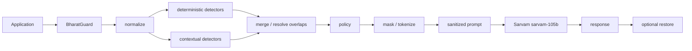

# BharatGuard

India-first PII detection and masking middleware for LLM applications, built
for Sarvam's `sarvam-105b` and Saaras v3.

## Why

LLM applications built for Indian users routinely handle PII that generic
Western-built redaction tools miss or mishandle: Aadhaar numbers, PAN cards,
Indian phone number formats, UPI IDs, IFSC codes, and free text that mixes
Hindi, Hinglish, and English in a single sentence (sometimes with Devanagari
digits). Sending that text straight to an external LLM provider means raw
PII leaves your application boundary before you've had a chance to look at
it.

BharatGuard sits between your application and Sarvam: it normalizes the
input text (Unicode composition, Indic-digit folding, whitespace
collapsing), detects PII with a mix of deterministic pattern/checksum
detectors (for structured identifiers like Aadhaar/PAN) and contextual
detectors (for free-text PERSON/ADDRESS mentions), and masks or tokenizes
what it finds according to a configurable policy — all locally, before
anything is sent to Sarvam. If the LLM's response happens to echo back a
token, `restore()` swaps it back to the original value for your own
application's use.

This is a detection/masking library, not a compliance product — see
[Security positioning](#security-positioning) below.

## Quickstart (LOCAL / MOCKED — no API key required)

```bash
git clone <this-repo-url>
cd bharatguard
python -m venv .venv
source .venv/bin/activate
pip install -e ".[dev]"
python -m spacy download en_core_web_sm
python examples/quickstart.py
```

`examples/quickstart.py` runs entirely locally against a `FakeSarvamClient`
(no network call, no `SARVAM_API_KEY` needed) and prints both the explicit
`protect()`/`restore()` flow and the `guard.chat()` convenience flow.

## Real Sarvam setup (LIVE SARVAM — API key required)

Only needed if you want to run the live examples (`examples/live_sarvam.py`,
`examples/voice_demo.py` with a real key) or the Streamlit demo in live mode:

```bash
cp .env.example .env
# then edit .env and set SARVAM_API_KEY=<your key>
```

Never commit `.env` or paste a real key into this README, an issue, or a
commit message. `.env` is already gitignored.

**What does and doesn't need a key:**

| Thing | Needs `SARVAM_API_KEY`? |
|---|---|
| `pytest` | No — zero network calls |
| `PIIGuard.protect()` / `.restore()` locally | No |
| `python examples/quickstart.py` | No (mocked) |
| Streamlit demo, local/mock mode | No |
| `python evals/run_eval.py` | No — zero network calls |
| `python examples/live_sarvam.py` | Yes |
| `python examples/voice_demo.py` | Yes |
| Streamlit demo, live mode | Yes (picked up automatically if set) |

## Architecture

Text/chat flow:



Voice flow:


Raw audio necessarily reaches Sarvam's STT endpoint (there is no way to get
a transcript otherwise); the resulting *text* transcript is what gets
protected before it goes anywhere near the chat model.

## API example

Both APIs are real, working code matching `src/bharatguard/core.py`.

**Explicit low-level API:**

```python
from bharatguard import PIIGuard
from bharatguard.integrations.sarvam import SarvamClient  # or FakeSarvamClient for no-network use

guard = PIIGuard()
client = SarvamClient()  # requires SARVAM_API_KEY

protected = guard.protect([{"role": "user", "content": "My Aadhaar is 234123412346."}])
response = client.chat(protected.messages)
restored = guard.restore(response.choices[0].message.content, protected.session)
```

**Convenience API** — `guard.chat()` composes the exact same
protect -> chat -> restore flow as the explicit version above, in one call:

```python
from bharatguard import PIIGuard
from bharatguard.integrations.sarvam import SarvamClient

guard = PIIGuard()
client = SarvamClient()

restored = guard.chat(client, [{"role": "user", "content": "My Aadhaar is 234123412346."}])
```

`client` is duck-typed — anything with a `.chat(messages=...)` method
matching `SarvamClient`'s contract works, including `FakeSarvamClient` for
tests/demos.

## Supported PII

**Deterministic** (pattern/checksum-based, on structured identifiers):

| Type | What |
|---|---|
| AADHAAR | 12-digit Aadhaar number (Verhoeff checksum validated) |
| PAN | PAN card number |
| PHONE | Indian phone number formats |
| EMAIL | Email address |
| UPI | UPI ID |
| IFSC | Bank IFSC code |

**Contextual** (free-text, model/heuristic-based):

| Type | What |
|---|---|
| PERSON | Person name mentions (via spaCy `en_core_web_sm`) |
| ADDRESS | Indian address mentions (heuristic keyword-based detector) |

This list is not exhaustive coverage of all possible Indian PII — see
[Known limitations](#known-limitations).

## Policy

Every detected entity type maps to an action: `mask` (replace with
`[REDACTED]`), `tokenize` (replace with a reversible `<TYPE_n>` token), or
`ignore` (leave as-is). The default policy
(`bharatguard.policy.policy.DEFAULT_POLICY`) is:

| Entity type | Default action |
|---|---|
| AADHAAR | mask |
| PAN | mask |
| IFSC | mask |
| PHONE | tokenize |
| EMAIL | tokenize |
| UPI | tokenize |
| PERSON | tokenize |
| ADDRESS | mask |

Pass a `PolicyConfig(overrides={...})` to `PIIGuard(policy=...)` to override
individual entity types; unspecified types keep their default. Token
mappings (the original value behind a `<TYPE_n>` token) are held in memory
on the per-call `Session` object only — BharatGuard never persists them to
disk, a database, or any external service.

## Evaluation results

Methodology: span-level exact match (predicted `(type, start, end)` must
exactly match ground truth) against `evals/dataset.jsonl`, a 51-example
synthetic dataset (47 total ground-truth PII values, plus false-positive
traps with no PII). Two configurations are compared over the same dataset
with the same detector code:

- **Config A** (deterministic only): Precision=1.000, Recall=0.696, F1=0.821
- **Config B** (deterministic + contextual): Precision=0.820, Recall=0.891, F1=0.854
- **Privacy leakage** (exact-substring + canonicalized-structured-value
  check, on `PIIGuard().protect()` output under `DEFAULT_POLICY`): 2/47
  ground-truth PII values leaked — both are known Devanagari PERSON
  detection limitations.

Run it yourself: `python evals/run_eval.py` (add `--debug` for
per-example detail — this prints raw synthetic PII to your terminal, so
only use it locally). No network calls are made.

These numbers are a measurement on this specific 51-example synthetic
dataset, not a universal guarantee — they do not generalize to arbitrary
real-world Indian-language input.

## Known limitations

- Devanagari-script PERSON detection is weak: `en_core_web_sm` is an
  English-only spaCy model, so Hindi-script names are frequently missed.
- PERSON detection is also unreliable on some romanized Hinglish text (not
  just pure Devanagari), as found during evaluation.
- The heuristic ADDRESS detector can false-positive on innocuous sentences
  that merely contain address-like keywords.
- UPI detection has inherent regex ambiguity against malformed or
  no-TLD email-like strings.
- Deterministic structured-identifier detection (Aadhaar/PAN/PHONE/EMAIL/
  UPI/IFSC) is materially stronger and more reliable than contextual
  PERSON/ADDRESS detection.
- Normalization is intentionally narrow in scope — NFC, Indic-digit
  folding, and whitespace collapsing only. This is a deliberate tradeoff to
  keep offset tracking exact, not a bug.
- No PII detector can guarantee arbitrary unseen PII will always be caught.

## Security positioning

BharatGuard is a technical privacy control that reduces unnecessary
exposure of personal data before it reaches an external LLM provider. It is
**not** a compliance product — using it does not by itself make your
application DPDP compliant or satisfy any other legal/regulatory
requirement.

- Detection happens entirely locally.
- Raw PII is never sent to Sarvam for detection purposes (only already-
  masked/tokenized text is sent to the chat model — see note above about
  audio necessarily reaching Sarvam's STT for transcription).
- Token mappings live in memory only, scoped to a single `PIIGuard.protect()`
  call's `Session`, and are never persisted.
- The pytest suite makes zero network calls.
- All examples, tests, and evaluation fixtures use synthetic PII only.

## Streamlit demo

```bash
streamlit run demo/app.py
```

Local/mock mode (no `SARVAM_API_KEY` set) works out of the box, using a
`FakeSarvamClient` with a canned response. Live mode picks up
`SARVAM_API_KEY` from your environment/`.env` automatically — no extra flag
needed, `demo/app.py` checks `os.environ.get("SARVAM_API_KEY")` itself.

The UI shows, in order: your input text, detected PII (entity type and
confidence only — not the underlying matched value), the protected text,
the outgoing Sarvam request payload, the Sarvam response, and the restored
response with tokens swapped back.

## Voice demo

```bash
python examples/voice_demo.py <path-to-audio-file>
```

Requires a real `SARVAM_API_KEY` (exits with a clear message and no
traceback if it's missing, and likewise if the given file path doesn't
exist). Flow: local audio file -> Sarvam Saaras v3 speech-to-text ->
transcript -> `PIIGuard.protect()` -> sanitized transcript ->
`sarvam-105b` -> response -> `PIIGuard.restore()`.

A synthetic sample audio file is committed at
`examples/sample_audio/synthetic_pii_sample.wav` (16kHz mono 16-bit PCM
WAV, generated via macOS `say` — see
`examples/sample_audio/README.md` for the exact generation command and
regeneration instructions if you ever need to reproduce it). It says a
fabricated Aadhaar number (`234123412346`) and phone number
(`9876543210`) — the same synthetic values used throughout this project's
tests and examples, not real data.

```bash
python examples/voice_demo.py examples/sample_audio/synthetic_pii_sample.wav
```

## Evaluation

```bash
python evals/run_eval.py
```

Runs entirely offline against `evals/dataset.jsonl` (no network calls).
Compares deterministic-only detection against deterministic+contextual
detection, reporting precision/recall/F1 (overall and per entity type), a
privacy-leakage check on `PIIGuard().protect()` output, and per-example
latency. See [Evaluation results](#evaluation-results) above for the
current numbers and methodology.

## Testing

```bash
pytest
```

160 tests passing, zero network calls.

## License

MIT — see [LICENSE](LICENSE).
